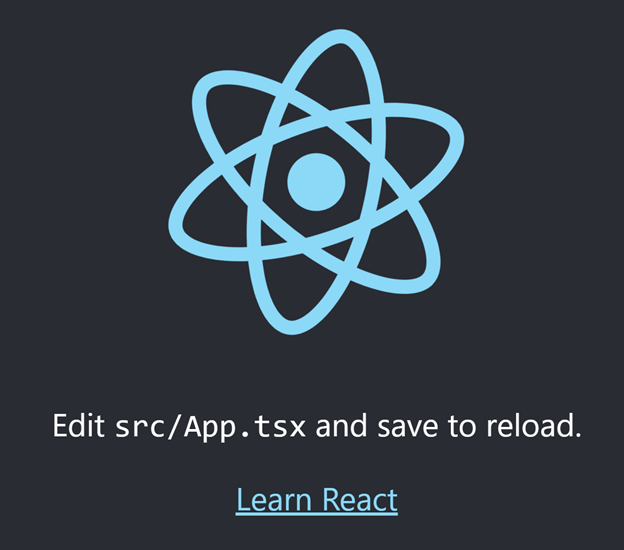
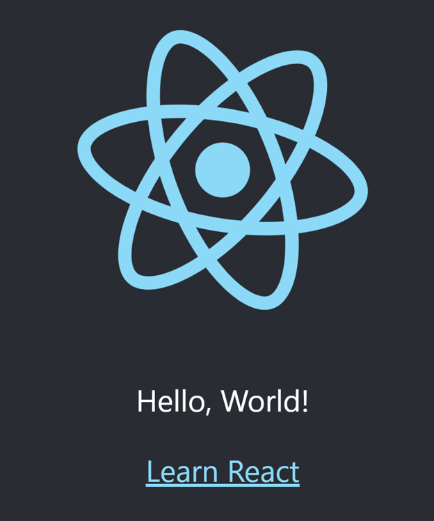
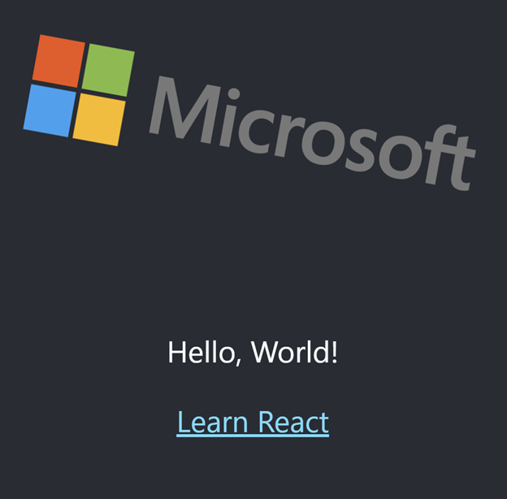
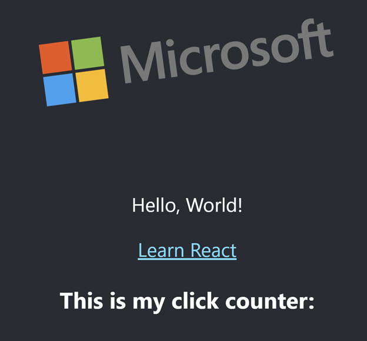
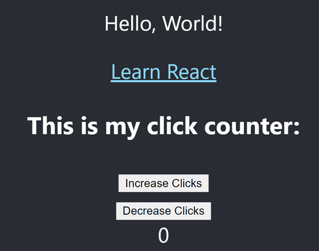

# React Code Kata

React is a popular framework for front-end applications.
This "hello" application is designed to walk you through a few basic steps of working with React.

## Challenge 1 - Get it running

First, you'll need to install dependencies.
From the root of `hello`, run `npm install`.

Next, to start the application, run `npm start`.
This will invoke `react-scripts start` and open your browser to `localhost:3000`, where your application will be running.

## Challenge 2 - Make a change

The home page should look something like this:



Make it look something like this (ignore the position of the logo - it is constantly rotating):



You should be able to do this without restarting the application.

## Challenge 3 - Change the logo

Make your site look like this (again, ignore rotational position):



## Challenge 4 - Add a component

Next, we'll add our own [React component](https://reactjs.org/docs/components-and-props.html).

After you create your `ClickCounter` component, your `App` function should look something like this:

```typescript
import { ClickCounter } from './clickCounter';

function App() {
  return (
    <div className="App">
      <header className="App-header">
        // ... (same as before)

        // This is the important part
        <ClickCounter/>
      
      </header>
    </div>
  );
}
```

and your app should look something like:



## Challenge 5 - State Management

This is where things start to get fun.
One of the coolest parts of React is the ability for the page to change with new data without needing to reload.
We're going to introduce a basic feature that will help demonstrate the power of React state management using a new-ish feature called [React hooks](https://reactjs.org/docs/hooks-intro.html).

Within our `ClickCounter` component, we'll add the following

- Display the current click count
- 1 button to increment the click count (current count is incremented by 1)
- 1 button to decrement the click count (current count is decremented by 1)



**Hint: `useState()` will be useful here*

## Challenge 6 - Conditional Rendering

We'll build on challenge 5 by introducing a simple toggle switch that will hide or show our click counter.
For this, we'll install the [`react-switch` library](https://www.npmjs.com/package/react-switch).
This should set a state variable that indicates whether to show the `ClickCounter` component or not.
React allows you to render blocks based on conditional statements like this:

```typescript
{showCounter && <ClickCounter/>}
```

If `showCounter` is `true`, `<ClickCounter/>` will be rendered. If not, it will be hidden.

## Challenge 7 - Props

As you've noticed, whenever you hide your click counter, the count gets reset to 0.
How will we keep track of our precious clicks?
Is there any hope?


The answer is [props](https://reactjs.org/docs/components-and-props.html)

Rather than maintain the click count inside the counter component, we'll maintain it in the `App` component so it's not destroyed every time the counter is hidden.

**Hint: `{showCounter && <ClickCounter count={clickCount} setCount={setClickCount}/>}`*

